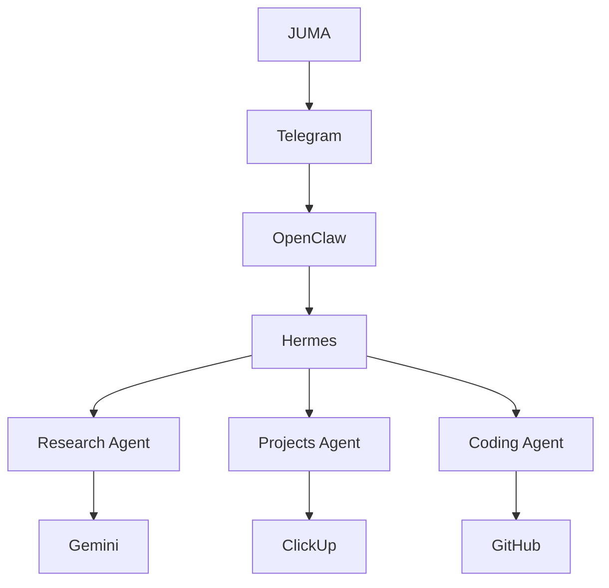

# JUMA — Freelance Software Engineering Agentic OS

**Status:** Integration artifact complete; runtime verified partially  
**Architecture:** Hermes-brain, OpenClaw-gateway, specialist agents  
**Current model:** `stepfun/step-3.7-flash:free` via Nous provider  
**License:** MIT

---

## What It Is

JUMA is a personal freelance software engineering operating system. It automates the path from an unstructured client enquiry to a structured proposal, project record, and approval request — without sending anything externally without human approval.

## Problem It Solves

Freelance client enquiries arrive unstructured and scattered. JUMA classifies the enquiry, selects the right specialist, gathers evidence, prepares a draft proposal, and presents a concise approval request — in approximately five minutes for normal enquiries.

## Target User

Juma Moya — freelance software engineer. The system is opinionated for a single-user, Telegram-first workflow.

## Architecture



### Hermes
Primary agentic brain. Understands objectives, maintains task state, reasons about what needs to happen, decides which specialist agents and tools are appropriate, observes results, verifies results, adapts/retries/replans when necessary, and prepares approval requests for Juma.

### OpenClaw
Communication gateway. Receives and routes user interactions from Telegram. Must not become a competing autonomous brain. May delegate to Hermes.

### Telegram
Human communication interface. Two bots are configured:
- Hermes bot: `8917859111` — allowlist `1360833951`
- OpenClaw bot: `8845344838` — allowlist `1360833951`

### Research Agent
Standalone Python process. Bounded research and evidence gathering only. Distinguishes facts, assumptions, and unknowns. Returns structured JSON. Forbidden from external business actions.

### Projects Agent
Standalone Node.js process. Bounded ClickUp/project-management operations. Respects READ vs INTERNAL WRITE vs EXTERNAL ACTION authority levels. Must not become the global orchestrator.

### Coding Agent
Standalone Python process. Bounded software-engineering responsibilities only. Applies J15 verification:
1. Syntax check always
2. Run available tests when tests exist or were created
3. Safely execute a trivial/diagnostic entry point when appropriate

### Gemini
Coding/research/proposal capability where appropriate. It is a capability available to the system, not the system's architectural brain.

### ClickUp
Project/task management system. Integrated via REST API wrapper.

### GitHub
Source control and code delivery. Integrated via `gh` CLI.

## Human Approval Boundary

The system enforces three explicit authority levels:

- **READ** — inspect information; research; analyse; retrieve data
- **INTERNAL WRITE** — create/update internal working state; drafts; local files; internal project information
- **EXTERNAL ACTION** — sending messages externally; publishing; submitting; committing/pushing where consequential; sending proposals to clients

External actions require explicit human approval unless an already-defined safe policy explicitly permits it.

The approval boundary:
1. Detects when an action requires approval
2. Describes the proposed action clearly
3. Presents enough context for Juma to make an informed decision
4. Stops execution while awaiting approval
5. Resumes only after an explicit approval signal
6. Never interprets silence as approval
7. Never converts an error or timeout into approval
8. Records the approval decision
9. Executes only the approved action
10. Verifies the resulting external state
11. Reports the result

## Agentic Loop

Every meaningful task follows:

UNDERSTAND → CLASSIFY → IDENTIFY FACTS → IDENTIFY UNKNOWNS → DETERMINE CONSTRAINTS → PLAN → SELECT AGENTS → SELECT TOOLS → EXECUTE → OBSERVE → VERIFY → ADAPT / RETRY / REPLAN → PREPARE RESULT → REQUEST APPROVAL WHEN REQUIRED → WAIT FOR APPROVAL → EXECUTE APPROVED EXTERNAL ACTION → VERIFY OUTCOME → REPORT

The system must not merely execute a predetermined automation script and call that "agentic".

## Security Model

- No secrets in source code, logs, documentation, or responses
- Secrets are loaded from environment variables or secure stores
- `.gitignore` excludes `.env`, `config/*.secrets.json`, and evidence files
- CI grep-check rejects tracked files containing secret patterns
- Approval boundary prevents accidental external sends
- Evidence files contain only non-sensitive proposal/business information

## How To Run The System

### Prerequisites
- Python 3.11+
- Node.js 20+
- Git
- Hermes Agent runtime
- OpenClaw gateway
- Telegram bots configured

### Environment Setup
```bash
# Hermes runtime
export TELEGRAM_BOT_TOKEN="..."
export GEMINI_API_KEY="..."
export CLICKUP_TOKEN="..."

# OpenClaw runtime
export OPENROUTER_API_KEY="..."
```

### Run Specialist Agents
```bash
# Research Agent
python agents/research/main.py <<< '{"query":"competitor analysis","max_sources":3,"fetch_content":true}'

# Projects Agent
node agents/projects/main.js '{"action":"search_tasks","query":"proposal"}'

# Coding Agent
python agents/coding/main.py <<< '{"action":"explain","code":"def f(x): return x*2","language":"python"}'
```

### Run Orchestrator
```bash
python orchestrator/orchestrator.py <<< '{"task":"Research competitor pricing for SaaS CRMs"}'
```

### Run Flagship Workflow
```bash
python orchestrator/flagship.py <<< '{"enquiry":"Hi, I need a web app. Budget $10k, timeline 2 months."}'
```

## How To Test It

### Local Test Commands
```bash
# Approval boundary tests
PYTHONPATH=. python tests/test_step6_approval.py

# Flagship unit tests
PYTHONPATH=. python tests/test_step7_flagship_unit.py

# Flagship end-to-end tests
PYTHONPATH=. python tests/test_step7_flagship_e2e.py

# Flagship failure-injection tests
PYTHONPATH=. python tests/test_step7_flagship_failures.py

# Integration tests
PYTHONPATH=. python tests/test_step7_flagship_integration.py

# Syntax checks
python -m py_compile agents/research/main.py agents/coding/main.py orchestrator/orchestrator.py orchestrator/approval.py orchestrator/flagship.py
node --check agents/projects/main.js automation/clickup.js
```

### CI Pipeline
Push to `master` to trigger GitHub Actions `quality` workflow. It runs:
- Repository integrity/secret scan
- Python/Node.js/PowerShell syntax checks
- Approval boundary tests
- Flagship unit, E2E, failure-injection, and integration tests
- Documentation consistency checks

## Flagship Workflow

1. Receive unstructured client enquiry through Telegram
2. Understand and classify it
3. Extract known facts
4. Identify unknown/missing information
5. Determine constraints
6. Decide which specialists/tools are needed
7. Invoke Research when research is required
8. Invoke Projects when ClickUp/project records are required
9. Invoke Coding when technical analysis is required
10. Synthesise the collected information
11. Prepare a proposal draft
12. Verify the proposal
13. Present Juma with a concise approval request
14. Wait for explicit approval
15. Only then perform the approved external action
16. Verify the result
17. Report completion

## Known Limitations

- Research agent uses DuckDuckGo HTML scraping; may break if page layout changes
- Projects agent uses hard-coded ClickUp team ID
- Coding agent test execution requires pytest/npm to be installed; skipped if absent
- OpenClaw → Hermes routing plugin artifact is implemented and loaded, but actual Hermes invocation from OpenClaw has not been demonstrated through the installed CLI surface
- Approval UI is filesystem-based; no Telegram prompt delivery yet
- External action execution is boundary-recorded only; not wired to Telegram/OpenClaw yet
- Classification is keyword-based, not semantic
- `.approval` directory is local filesystem only
- Research agent occasionally returns `no_results` without fallback
- Telegram bot token in OpenClaw config returns HTTP 401; Telegram E2E is not testable with current credentials
- Deterministic all-message routing to Hermes would require a custom OpenClaw channel plugin beyond the installed SDK
- OpenClaw scheduled task metadata may show stale `Runtime: stopped` even when gateway is healthy

## Current Model/Runtime Assumptions

- Hermes primary model: `stepfun/step-3.7-flash:free` via Nous provider
- Node.js: v22+ for Projects agent and automation
- Python: 3.11+ for Research, Coding, and Orchestrator
- Windows 11 host; bash-compatible shell for automation
- No paid LLM subscriptions required; architecture is model-agnostic

## Future Roadmap

- Wire OpenClaw → Hermes routing (`hermes chat -q`)
- Implement Telegram-based approval prompts
- Implement approved external action execution
- Add semantic classification for enquiry routing
- Improve research agent resilience
- Add coverage measurement to CI
- Add Windows runner for PowerShell syntax checks

## Repository Structure

```
.
├── agents/
│   ├── coding/main.py
│   ├── projects/main.js
│   └── research/main.py
├── automation/
│   ├── clickup.js
│   └── generate-proposal.ps1
├── config/
│   └── juma.json
├── documentation/
│   ├── PHASE-1-RECONNAISSANCE-REPORT.md
│   ├── PHASE-2-DECISIONS.md
│   ├── PHASE-2-IMPLEMENTATION-PLAN.md
│   ├── coding-agent.md
│   ├── projects-agent.md
│   ├── research-agent.md
│   └── stack.md
├── orchestrator/
│   ├── __init__.py
│   ├── approval.py
│   ├── flagship.py
│   └── orchestrator.py
├── tests/
│   ├── test_step6_approval.py
│   ├── test_step7_flagship_unit.py
│   ├── test_step7_flagship_e2e.py
│   ├── test_step7_flagship_failures.py
│   └── test_step7_flagship_integration.py
└── .github/workflows/quality.yml
```

## License

MIT
